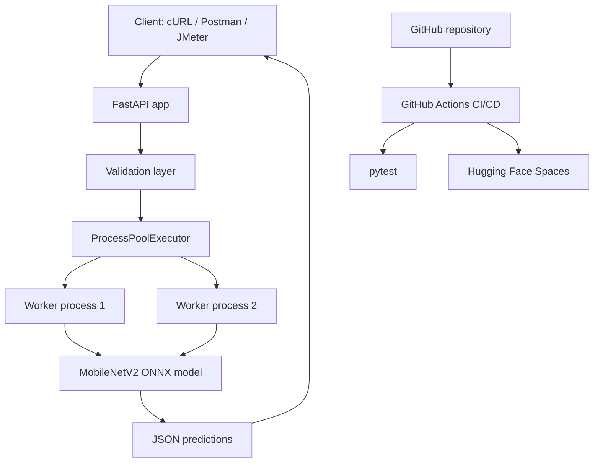
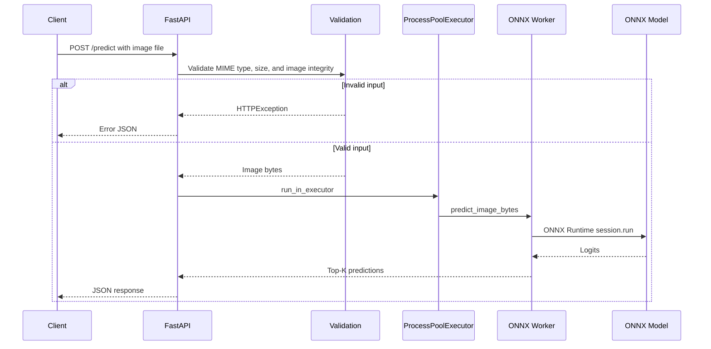
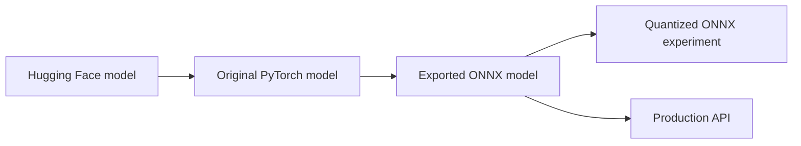

# Project Report: High-Throughput Image Classification API

> Course: AIE494
> Team Members:
> 1. นายธนนท์ จิตรพรหม 1650904194
> 2. นายเจตนิพัทธ อินทรีย์ 1650901471
> 3. นายนิธิกุล แก้วไพฑูรย์ 1650903808
> Repository: https://github.com/KengJoJo/AIE494-Project
> Hugging Face Space: https://huggingface.co/spaces/KengJoJo/AIE494-Project
> Cloud API URL: https://kengjojo-aie494-project.hf.space
> Date: May 16, 2026

## 1. Project Overview

This project implements a production-style image classification API. The service
accepts an uploaded image through a REST endpoint, validates the input, runs
MobileNetV2 inference with ONNX Runtime, and returns the top predicted ImageNet
classes as JSON.

The project focuses on practical machine-learning deployment concerns:

- Model conversion and optimization for CPU inference
- FastAPI service design
- Input validation and structured error handling
- Concurrent request processing
- Docker-based deployment
- CI/CD with GitHub Actions
- Load testing with Apache JMeter

## 2. Selected Model and Purpose

| Attribute | Value |
| --- | --- |
| Model | `google/mobilenet_v2_1.0_224` |
| Source | Hugging Face Transformers |
| Task | Image classification |
| Dataset/classes | ImageNet-1K, 1,000 classes |
| Input shape | 224 x 224 RGB image |
| Deployment format | ONNX |
| Inference engine | ONNX Runtime CPUExecutionProvider |

MobileNetV2 was selected because it is lightweight, fast on CPU, and suitable
for real-time API inference. The model is large enough to demonstrate a real
computer-vision workload but small enough to deploy on a low-cost CPU cloud
environment such as Hugging Face Spaces.

The purpose of the model is to classify general images into ImageNet categories.
In this project, it is used to demonstrate how a machine-learning model can be
optimized, packaged, tested, deployed, and exposed through an API.

## 3. System Architecture



### Request Flow



### Model Optimization Pipeline



## 4. API Design

| Method | Endpoint | Description |
| --- | --- | --- |
| GET | `/` | Service status |
| GET | `/health` | Health check and active model status |
| POST | `/predict` | Upload image and return top-K predictions |

Example local request:

```bash
curl -X POST "http://localhost:8000/predict" \
  -H "accept: application/json" \
  -F "file=@test_cat.jpg;type=image/jpeg"
```

Example cloud request:

```bash
curl -X POST "https://kengjojo-aie494-project.hf.space/predict" \
  -H "accept: application/json" \
  -F "file=@test_cat.jpg;type=image/jpeg"
```

Example response:

```json
{
  "filename": "test_cat.jpg",
  "content_type": "image/jpeg",
  "model_type": "onnx",
  "latency_ms": 12.34,
  "predictions": [
    {
      "label": "tabby, tabby cat",
      "score": 0.7842
    }
  ]
}
```

## 5. Model Optimization Results

The benchmark was executed with `test_cat.jpg`, 20 warm-up iterations, and 50
measured iterations.

| Model Type | Size (MB) | Avg (ms) | P50 (ms) | P95 (ms) | Min (ms) | Max (ms) |
| --- | ---: | ---: | ---: | ---: | ---: | ---: |
| Original PyTorch | 13.54 | 17.74 | 17.32 | 22.22 | 13.32 | 25.99 |
| ONNX | 0.33 | 2.23 | 2.19 | 2.60 | 1.95 | 2.69 |
| Quantized ONNX | 3.60 | 20.10 | 19.36 | 22.25 | 17.87 | 39.10 |

### Optimization Analysis

The ONNX model is the best production choice in this experiment. It reduced
average latency from 17.74 ms to 2.23 ms, which is approximately 7.95x faster
than the original PyTorch model. It also reduced the measured model file size
from 13.54 MB to 0.33 MB.

The quantized ONNX model was tested as an optimization experiment, but it was
not selected for production because its measured latency was worse than the
standard ONNX model on this machine. In addition, earlier manual checks showed
weaker prediction quality for the quantized model. Therefore, the deployed API
uses `MODEL_TYPE=onnx`.

## 6. Error Handling and Data Validation

The API validates user input before running inference. This prevents corrupted
files, unsupported content types, and oversized uploads from reaching the model
worker.

| Scenario | HTTP Status | Handling Strategy |
| --- | ---: | --- |
| Valid JPEG, PNG, or WEBP image | 200 | Return predictions as JSON |
| Unsupported MIME type | 400 | Reject request with a clear error message |
| Corrupted or non-image file | 400 | Pillow verification fails and API returns error JSON |
| File larger than 5 MB | 413 | Reject request before inference |
| Missing `file` field | 422 | FastAPI validation error |
| Missing model artifact | 500 | Return server error indicating model file is missing |
| Unexpected inference failure | 500 | Log exception and return structured error JSON |

Validation checks implemented:

- Accept only `image/jpeg`, `image/png`, and `image/webp`
- Enforce `MAX_UPLOAD_SIZE_MB=5`
- Verify image integrity with Pillow `Image.verify()`
- Return typed Pydantic response schemas for successful responses
- Execute CPU-bound inference outside the FastAPI event loop

## 7. JMeter Load Testing

The JMeter test plan is located at:

```text
jmeter/image_classification_load_test.jmx
```

Test plan configuration:

| Setting | Value |
| --- | --- |
| Concurrent users | 50 |
| Ramp-up | 10 seconds |
| Loop count | 10 |
| Total requests | 500 |
| Endpoint | `POST /predict` |
| Request type | `multipart/form-data` image upload |
| Assertions | HTTP 200 and JSON predictions exist |

### Local JMeter Command

```bash
jmeter -n -t jmeter/image_classification_load_test.jmx \
  -JPROTOCOL=http -JHOST=localhost -JPORT=8000 \
  -JIMAGE_PATH="C:/Work/AIE494/ProjectAIE494/test_cat.jpg" \
  -l results/local_results.jtl \
  -e -o results/local_dashboard
```

### Cloud JMeter Command

```bash
jmeter -n -t jmeter/image_classification_load_test.jmx \
  -JPROTOCOL=https -JHOST=kengjojo-aie494-project.hf.space -JPORT=443 \
  -JIMAGE_PATH="C:/Work/AIE494/ProjectAIE494/test_cat.jpg" \
  -l results/cloud_results.jtl \
  -e -o results/cloud_dashboard
```

### JMeter Dashboard Results

Fill this table after running JMeter and opening the generated HTML dashboard.

| Environment | Total Requests | Throughput | Avg Response Time | P95 Latency | Error Rate |
| --- | ---: | ---: | ---: | ---: | ---: |
| Local Docker/API | 500 | [Fill] | [Fill] | [Fill] | [Fill] |
| Hugging Face Spaces | 500 | [Fill] | [Fill] | [Fill] | [Fill] |

### Performance Analysis

The expected local bottleneck is CPU inference capacity. The API uses
`ProcessPoolExecutor` with two worker processes, so requests beyond the worker
capacity will queue. This design keeps the FastAPI event loop responsive while
the CPU-bound model work runs in separate processes.

Cloud performance is expected to be slower than local execution because Hugging
Face Spaces free CPU hardware has limited resources and network latency is
added. If throughput is insufficient, possible improvements include increasing
worker count, moving to a larger CPU instance, using GPU inference, adding
request limits, or deploying multiple replicas behind a load balancer.

## 8. Testing Artifacts

| Artifact | Path |
| --- | --- |
| Pytest tests | `tests/` |
| Benchmark output | `results/benchmark_results.md` and `results/benchmark_results.csv` |
| JMeter test plan | `jmeter/image_classification_load_test.jmx` |
| JMeter local dashboard | `results/local_dashboard/` after generation |
| JMeter cloud dashboard | `results/cloud_dashboard/` after generation |
| Postman collection | `postman/image-classification-api.postman_collection.json` |

Pytest result from the local environment:

```text
17 passed
```

## 9. CI/CD Pipeline

The CI/CD pipeline is defined in:

```text
.github/workflows/ci-cd.yml
```

Pipeline stages:

1. Checkout source code from GitHub
2. Set up Python 3.11
3. Cache pip dependencies
4. Install dependencies from `requirements.txt`
5. Run `pytest -q --tb=short`
6. On pushes to `main`, prepare model artifacts
7. Deploy the Docker Space to Hugging Face Spaces

Required GitHub secrets:

| Secret | Description |
| --- | --- |
| `HF_TOKEN` | Hugging Face token with write access |
| `HF_SPACE_ID` | Target Space ID, for example `username/image-classification-api` |

## 10. Deployment

The project can be deployed to Hugging Face Spaces as a Docker Space. The
Dockerfile exposes port `7860`, which matches the Hugging Face Spaces default
for web apps. Docker Compose maps local port `8000` to container port `7860`
for local testing.

Local Docker command:

```bash
docker compose up --build
```

Cloud URL format:

```text
https://kengjojo-aie494-project.hf.space
```

## 11. Problems and Solutions

| Problem | Solution |
| --- | --- |
| CPU-bound inference can block request handling | Move inference into `ProcessPoolExecutor` workers |
| Model loading is expensive | Lazy-load ONNX Runtime session once per worker process |
| Invalid uploads can cause runtime errors | Validate MIME type, file size, and image integrity before inference |
| Quantized model was not faster in the measured environment | Use standard ONNX model for production and document quantized results as an experiment |
| Large model files are difficult to store in Git | Track model artifacts with Git LFS when pushing to GitHub/Hugging Face |

## 12. Conclusion

The project successfully implements an image classification API with a clear
production deployment path. The ONNX model provides the best measured latency,
the API includes validation and structured errors, the codebase includes unit
tests, and the repository contains CI/CD, Docker, JMeter, Postman, and reporting
artifacts.

Future improvements include GPU inference, autoscaling, request rate limiting,
model monitoring, and additional benchmark runs on different hardware.

## Appendix A: Final Submission Checklist

- Export this report as PDF
- Add student name, student ID, repository URL, and cloud API URL
- Run local JMeter test and paste dashboard metrics into Section 7
- Run cloud JMeter test and paste dashboard metrics into Section 7
- Include `jmeter/image_classification_load_test.jmx`
- Include `postman/image-classification-api.postman_collection.json`
- Include the cloud cURL command for `/predict`
- Push source code and `.github/workflows/ci-cd.yml` to GitHub
