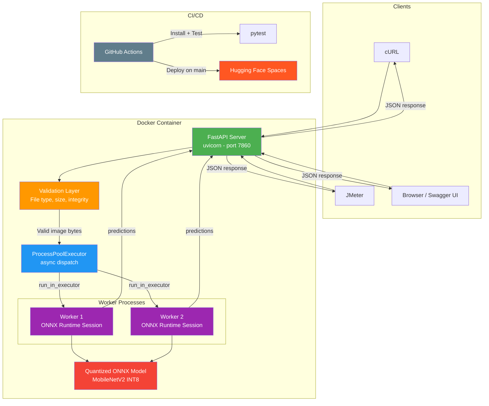
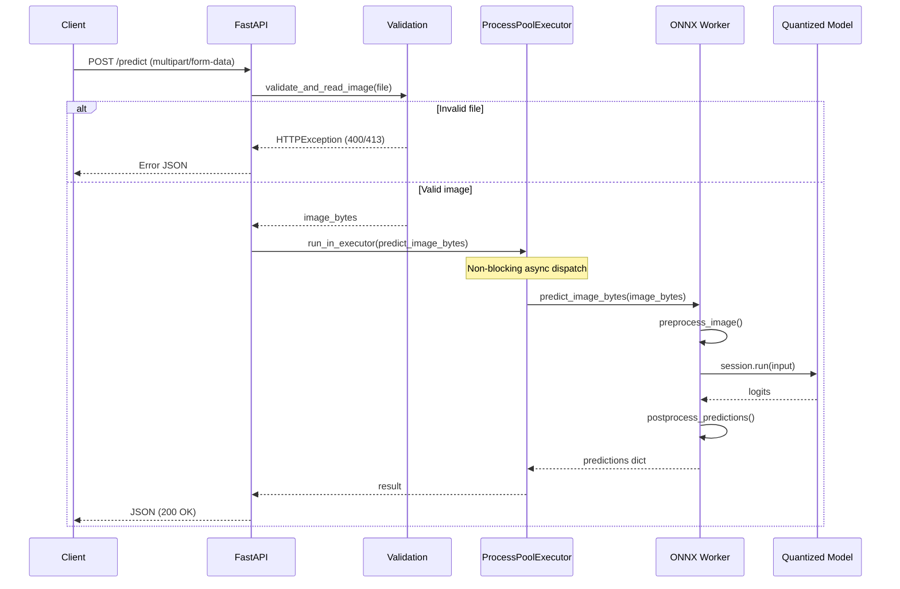

# System Architecture

## High-Level Architecture Diagram

```mermaid
graph TB
    subgraph Clients
        A[cURL]
        C[JMeter]
        D[Browser / Swagger UI]
    end

    subgraph "Docker Container"
        E[FastAPI Server<br/>uvicorn - port 7860]
        F[Validation Layer<br/>File type, size, integrity]
        G[ProcessPoolExecutor<br/>async dispatch]

        subgraph "Worker Processes"
            H1[Worker 1<br/>ONNX Runtime Session]
            H2[Worker 2<br/>ONNX Runtime Session]
        end

        I[Quantized ONNX Model<br/>MobileNetV2 INT8]
    end

    subgraph "CI/CD"
        J[GitHub Actions]
        K[pytest]
        L[Hugging Face Spaces]
    end

    A --> E
    C --> E
    D --> E

    E --> F
    F -->|Valid image bytes| G
    G -->|run_in_executor| H1
    G -->|run_in_executor| H2
    H1 --> I
    H2 --> I
    H1 -->|predictions| E
    H2 -->|predictions| E
    E -->|JSON response| A
    E -->|JSON response| C
    E -->|JSON response| D

    J -->|Install + Test| K
    J -->|Deploy on main| L

    style E fill:#4CAF50,color:#fff
    style F fill:#FF9800,color:#fff
    style G fill:#2196F3,color:#fff
    style H1 fill:#9C27B0,color:#fff
    style H2 fill:#9C27B0,color:#fff
    style I fill:#F44336,color:#fff
    style J fill:#607D8B,color:#fff
    style L fill:#FF5722,color:#fff
```

## Request Flow

```mermaid
sequenceDiagram
    participant Client
    participant FastAPI
    participant Validation
    participant Executor as ProcessPoolExecutor
    participant Worker as ONNX Worker
    participant Model as Quantized Model

    Client->>FastAPI: POST /predict (multipart/form-data)
    FastAPI->>Validation: validate_and_read_image(file)

    alt Invalid file
        Validation-->>FastAPI: HTTPException (400/413)
        FastAPI-->>Client: Error JSON
    else Valid image
        Validation-->>FastAPI: image_bytes
        FastAPI->>Executor: run_in_executor(predict_image_bytes)
        Note over Executor: Non-blocking async dispatch

        Executor->>Worker: predict_image_bytes(image_bytes)
        Worker->>Worker: preprocess_image()
        Worker->>Model: session.run(input)
        Model-->>Worker: logits
        Worker->>Worker: postprocess_predictions()
        Worker-->>Executor: predictions dict

        Executor-->>FastAPI: result
        FastAPI-->>Client: JSON (200 OK)
    end
```

## Model Optimization Pipeline

```mermaid
graph LR
    A["Hugging Face Hub<br/>google/mobilenet_v2_1.0_224"] -->|download_model.py| B["PyTorch Model<br/>models/original/"]
    B -->|export_onnx.py| C["ONNX Model<br/>models/onnx/model.onnx"]
    C -->|quantize_onnx.py| D["Quantized ONNX<br/>models/quantized/model_quantized.onnx"]
    D -->|"Production API"| E["ONNX Runtime<br/>CPU Inference"]

    style A fill:#FFD54F,color:#333
    style B fill:#42A5F5,color:#fff
    style C fill:#66BB6A,color:#fff
    style D fill:#EF5350,color:#fff
    style E fill:#AB47BC,color:#fff
```
